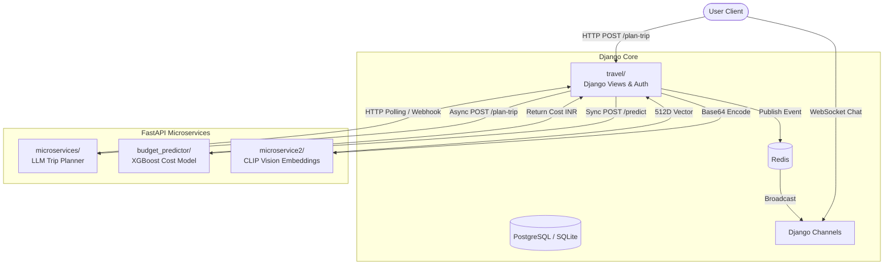

# VoyAgent — AI Travel Planner

[](https://python.org) [](https://djangoproject.com) [](https://fastapi.tiangolo.com) [](LICENSE)

**VoyAgent** is an advanced AI-powered travel planning platform for solo and group travelers. Describe where you want to go, and VoyAgent builds a full multi-day itinerary — complete with personalized geographic clustering, intelligent budget estimations, real-time collaboration, and visual semantic search.

🌐 **Live demo:** [voyagent-mzei.onrender.com](https://voyagent-mzei.onrender.com)

---

## What it does

- **AI Itinerary Generation** — Uses a highly optimized, chunked, and asynchronous LLM pipeline (powered by Gemini 2.5 Flash) to generate heavily personalized multi-day travel plans without repetition or context saturation.
- **Intelligent Budget Estimation** — An independent ML microservice powered by XGBoost accurately predicts daily and total trip costs based on a synthesized model of real-world Indian travel economics.
- **Group Planning & Real-Time Chat** — Built-in WebSocket chat powered by Django Channels lets travelers coordinate, share images, and plan together instantly.
- **Visual Search & Categorization** — A dedicated CLIP-based vision microservice classifies and embeds uploaded chat images in real-time, allowing users to search destinations by photo.
- **Location-Aware Ranking** — Haversine distance scoring surfaces the most relevant nearby places.

---

## Architecture

VoyAgent operates on a service-oriented architecture, decoupling the main web gateway from heavy machine learning and generative AI workflows:



### Components
1. **`travel/` (Django Core):** The primary monolith handling the frontend UI, user authentication, session management, and Channels-based WebSocket connections for chat.
2. **`microservices/` (LLM Trip Planner):** A FastAPI service handling asynchronous generation of travel itineraries using Gemini 2.5 Flash. It utilizes a chunked generation strategy to bypass token limits.
3. **`microservice2/` (CLIP Vision):** A lightweight FastAPI service dedicated to generating 512-dimensional vector embeddings for images and text using `sentence-transformers` (`clip-ViT-B-32`).
4. **`budget_predictor/` (ML Budget Estimator):** A standalone FastAPI microservice that loads a pre-trained XGBoost model to provide sub-millisecond cost estimations based on group size, duration, destination, and pace.

---

## Getting started

**Prerequisites:** Python 3.12+, Git, Docker (recommended)

### 1. Clone & Setup Environment

```bash
git clone https://github.com/SwapnanilDatta/travel-planner-app.git
cd travel-planner-app

# Copy environment variables template
cp .env.example .env
```
*(Ensure you fill in your `.env` with real values like `GEMINI_API_KEY` and `DATABASE_URL`)*

### 2. Install Dependencies

You'll need separate virtual environments or install all dependencies in one:

```bash
python -m venv .venv
source .venv/bin/activate

# Install Django and overall dependencies
pip install -r requirements.txt

# Install microservice dependencies
pip install -r microservices/requirements.txt
pip install -r microservice2/requirements.txt
pip install -r budget_predictor/requirements.txt
```

### 3. Run the Services

**Terminal 1: Django Frontend**
```bash
cd travel
python manage.py migrate
python manage.py runserver 0.0.0.0:8000
```

**Terminal 2: LLM Trip Planner**
```bash
cd microservices
uvicorn main:app --reload --host 0.0.0.0 --port 8002
```

**Terminal 3: Vision Microservice**
```bash
cd microservice2
uvicorn main:app --reload --host 0.0.0.0 --port 8001
```

**Terminal 4: Budget Predictor**
```bash
cd budget_predictor
# Ensure the model is trained first
python train_model.py
uvicorn main:app --reload --host 0.0.0.0 --port 8003
```

Open [http://localhost:8000](http://localhost:8000) in your browser. API docs for the microservices are available at `/docs` on their respective ports.

---

## Environment variables

| Variable | Description |
|---|---|
| `SECRET_KEY` | Django secret key |
| `DEBUG` | `True` for local dev, `False` in production |
| `DATABASE_URL` | Postgres connection string |
| `MICROSERVICE_URL` | URL of the core FastAPI service (Trip Planner) |
| `MICROSERVICE2_URL` | URL of the vision microservice |
| `BUDGET_SERVICE_URL` | URL of the Budget Predictor microservice |
| `GEMINI_API_KEY` | Google Gemini API Key for itinerary generation |
| `HF_API_TOKEN` | Hugging Face API token |
| `OPENCAGE_API_KEY` | Geocoding API key |
| `CLOUDINARY_URL` | Image storage (optional) |
| `REDIS_URL` | Redis for Channels and Celery |

---

## API Reference

### LLM Trip Planner (`localhost:8002`)
- **`POST /plan-trip`**: Accepts a `TripRequest`. Returns an async `task_id`.
- **`POST /regenerate-day`**: Rewrites a specific itinerary day based on feedback.
- **`GET /task/{task_id}`**: Polling endpoint to retrieve the final generated Markdown itinerary.

### Budget Predictor (`localhost:8003`)
- **`POST /predict`**: Accepts a `BudgetRequest` (destination, month, duration, etc.) and instantly returns the estimated daily and total budget in INR.

### Vision Microservice (`localhost:8001`)
- **`POST /embed`**: Accepts either natural language or a base64 encoded image. Returns a 512-dimensional vector embedding.

---

## Deployment Strategy

Each unit ships its own `Dockerfile` allowing for a heavily distributed deployment model:
- **Django Core**: Best deployed on platforms like **Render** or Heroku with a managed PostgreSQL DB and Redis instance.
- **LLM Trip Planner**: Deployed on **FastAPI Cloud** or dedicated workers to prevent async LLM operations from timing out or blocking web threads.
- **Vision & Budget Microservices**: Highly suited for **Hugging Face Spaces** (Docker environments) to isolate heavy machine learning dependencies (`scikit-learn`, `xgboost`, `sentence-transformers`) away from standard web traffic.

---

## Troubleshooting

- **WebSocket errors**: Verify Django Channels is configured correctly and you are using an ASGI server (Daphne/Uvicorn). Ensure your `REDIS_URL` is active.
- **"Model not loaded" (Budget Predictor)**: Run `python train_model.py` inside the `budget_predictor/` directory to generate the `budget_model.pkl` file before starting the server.
- **Agent Generation Cut-offs**: If the generated itinerary stops abruptly, check your LLM provider limits or adjust the chunk size in `llm_wrapper.py`.

---

## Contributing

1. Fork the repo
2. Create a branch: `git checkout -b feat/your-feature`
3. Open a pull request with a clear description of what changed and why

## License

MIT — see [LICENSE](LICENSE) for details.

## Author

**Swapnanil Datta** — [github.com/SwapnanilDatta](https://github.com/SwapnanilDatta)
